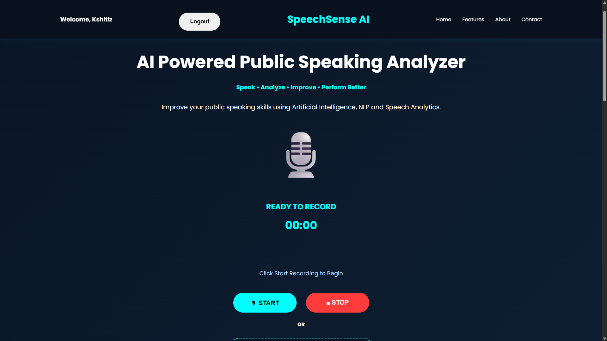
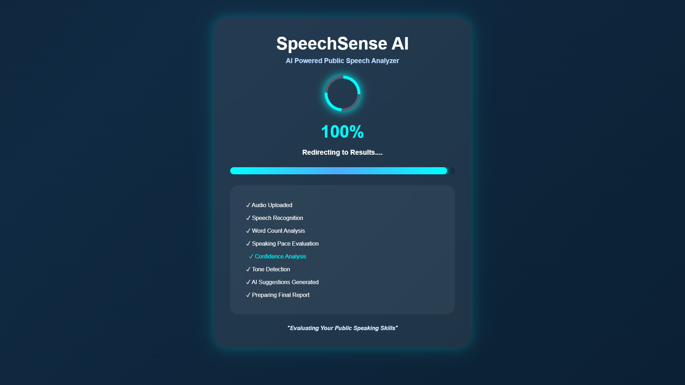
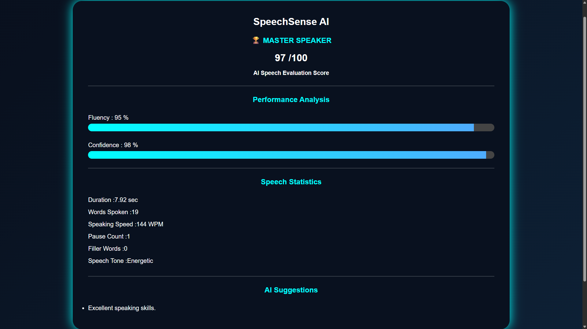

<div align="center">

# 🎙️ SpeechSense AI

### AI Powered Public Speaking Analyzer

> ### Analyze • Improve • Speak with Confidence


<br>


</div>

---

## 📌 About the Project

SpeechSense AI is an AI-powered Public Speaking Analyzer designed to evaluate speech and provide intelligent feedback for improvement.

The system analyzes:

- Fluency
- Confidence
- Speech Pace
- Pause Detection
- Filler Words
- Speech Tone
- Overall Performance Score
- AI Generated Suggestions

Whether you're preparing for interviews, presentations, debates, seminars or public speaking competitions, SpeechSense AI helps you become a better and more confident speaker.

---

## 🚀 Live Demonstration

<p align="center">

https://speech-sense-ai.onrender.com/login

</p>

---

## ✨ Features

- Speech Recording
- Audio File Upload
- Speech Recognition
- Fluency Analysis
- Confidence Analysis
- Pause Detection
- Speaking Pace Evaluation
- Tone Analysis
- AI Suggestions
- AI Performance Score
- Interactive Dashboard
- Responsive User Interface

---

## ⚙️ Working Flow

```text
                 User Speech
                       |
                       ↓
              Record / Upload Audio
                       |
                       ↓
                 Audio Processing
                       |
                       ↓
                Speech Recognition
                       |
                       ↓
         -----------------------------------
         |                 |               |
         ↓                 ↓               ↓
       WPM              Pauses           Fillers
    Calculation        Detection         Count
         |                 |               |
         -----------------------------------
                       |
                       ↓
                 Fluency Analysis
                       |
                       ↓
               Confidence Analysis
                       |
                       ↓
                  Tone Detection
                       |
                       ↓
                 Overall Score
                       |
                       ↓
                 AI Suggestions
                       |
                       ↓
               Final Evaluation Report
```

---

## 🏠 Homepage

<p align="center">

</p>

SpeechSense AI provides a modern and intuitive interface for speech recording and speech analysis.

---

## 🎤 Record or Upload Speech

<p align="center">

</p>

Users can:

- Record speech in real-time.
- Upload audio files.
- Analyze speech instantly.
- Receive AI-generated feedback.

### Supported Formats

```text
.wav
.mp3
```

---

## 🧠 AI Processing Engine

<p align="center">

</p>

During processing, SpeechSense AI performs:

- Audio Processing
- Speech Recognition
- Word Count Analysis
- Speaking Pace Evaluation
- Confidence Analysis
- Tone Detection
- AI Suggestions Generation
- Final Report Preparation

---

## 📊 AI Generated Speech Analysis Report

<p align="center">

</p>

SpeechSense AI generates a detailed performance report including:

### Performance Analysis

- Fluency Score
- Confidence Score
- Overall Performance Score

### Speech Statistics

- Duration
- Total Words Spoken
- Words Per Minute (WPM)
- Pause Count
- Filler Words Count
- Speech Tone Analysis

### AI Suggestions

- Personalized recommendations.
- Speaking improvements.
- Fluency enhancement tips.
- Confidence improvement strategies.

---

## 🎯 Parameters Analysed

| Parameter | Description |
|----------|------------|
| Duration | Total Speech Duration |
| Total Words | Number of Words Spoken |
| Speaking Speed | Words Per Minute |
| Fluency Score | Speaking Quality Analysis |
| Confidence Score | Confidence Evaluation |
| Pause Detection | Detects Unwanted Pauses |
| Filler Words | Detects Speech Fillers |
| Speech Tone | Tone Evaluation |
| Overall Score | Final Performance Score |
| AI Suggestions | Personalized Improvements |

---

## 📈 Scoring Criteria

### Fluency Score

Fluency is evaluated using:

- Speaking Pace
- Filler Words Usage
- Pause Count

### Confidence Score

Confidence depends upon:

- Speech Consistency
- Speaking Pace
- Number of Pauses
- Speech Quality

### Overall Score Calculation

```text
          Overall Score

                |
                ↓

       Fluency Score = 40%

      Confidence Score = 40%

   Filler Word Analysis = 20%

                |
                ↓

          Final Score
           out of 100
```

---

## 🛠 Tech Stack

| Technology | Usage |
|-----------|-------|
| Python | Backend Development |
| Flask | Web Framework |
| HTML5 | Frontend |
| CSS3 | Styling |
| JavaScript | User Interaction |
| SpeechRecognition | Speech Processing |
| Librosa | Audio Analysis |
| FFmpeg | Audio Conversion |
| NumPy | Numerical Computation |
| Machine Learning | Speech Evaluation |
| Git & GitHub | Version Control |
| Render | Deployment |

---

## 📂 Project Structure

```text
SpeechSense-AI/

│
├── assets/
│      banner.gif
│      demo.gif
│      Homepage.png
│      Recording.png
│      Processing.png
│      Result.png
│
├── static/
│      css/
│      js/
│      uploads/
│
├── templates/
│      index.html
│      processing.html
│      result.html
│
├── analysis_engine.py
├── speech_analysis.py
├── pause_detection.py
├── filler_words.py
├── speech_to_text.py
├── confidence_score.py
├── fluency_score.py
├── tone_analysis.py
│
├── app.py
├── requirements.txt
├── Procfile
└── README.md
```

---

## ⚙️ Installation

### Clone the Repository

```bash
git clone https://github.com/Kshitiz743/SpeechSense-AI.git
```

### Move to the Project Directory

```bash
cd SpeechSense-AI
```

### Create a Virtual Environment

```bash
python -m venv venv
```

### Activate Environment

#### Windows

```bash
venv\Scripts\activate
```

#### Linux / Mac

```bash
source venv/bin/activate
```

### Install Dependencies

```bash
pip install -r requirements.txt
```

### Run the Application

```bash
python app.py
```

Open your browser and visit:

```text
http://127.0.0.1:5000/
```

---

## 🔥 Future Enhancements

- Real-Time Speech Evaluation
- Emotion Detection
- AI Interview Preparation
- Multilingual Speech Support
- Facial Expression Analysis
- Speech History Tracking
- Personalized AI Speaking Coach
- Resume-Based Interview Practice
- Advanced Voice Analytics

---

## 🎓 Applications

SpeechSense AI can be used for:

- Public Speaking Practice
- Placement Preparation
- Interview Preparation
- Debate Competitions
- Classroom Presentations
- Personality Development Programs
- Corporate Communication Training
- Soft Skills Development

---

## 👨‍💻 Contributor

### Kshitiz Gupta

> Computer Science Student | AI & ML Enthusiast | Flask Developer

---

## 🤝 Contributing

Contributions are always welcome.

```text
Fork Repository
       ↓
Create New Branch
       ↓
Make Changes
       ↓
Commit Changes
       ↓
Push Changes
       ↓
Create Pull Request
```

---

## ⭐ Support

If you found this project useful:

- Give it a Star ⭐
- Fork the Repository 🍴
- Share it with others 🚀
- Contribute to the Project ❤️

---

## 📜 License

This project is developed for educational and research purposes.

Feel free to use, modify and improve it with proper attribution.

---

<div align="center">

## 🎤 "Great Speakers Are Not Born, They Are Built Through Practice."

# SpeechSense AI

### Analyze • Improve • Speak with Confidence

### Made with ❤️ using Python, Flask and Artificial Intelligence

</div>